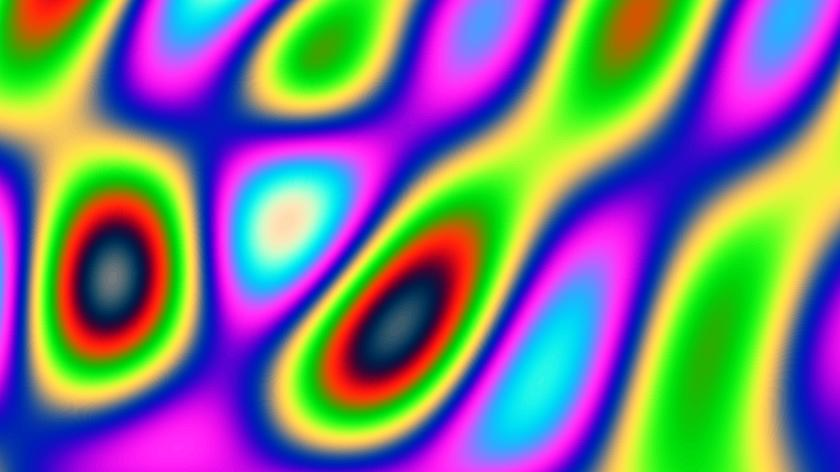

\[click on image to start to the interactive demonstration\]  
[](https://xyzzy.github.io/emotions/)

# Emotions

Interactive demoscene lava artwork dedicated to Peter.

### Welcome to the Wonderful World of shader rendering

You can change the formulas, just edit them in the appropriate boxes.

## Source code

Grab one of the tarballs at [https://github.com/xyzzy/emotions/releases](https://github.com/xyzzy/emotions/releases) or checkout the latest code:

```sh
        git clone https://github.com/xyzzy/emotions.git
```

## Versioning

Using [SemVer](http://semver.org/) for versioning. For the versions available, see the [tags on this repository](https://github.com/xyzzy/emotions/tags).

## License

This project is licensed under the MIT License - see the [LICENSE.txt](LICENSE.txt) file for details
