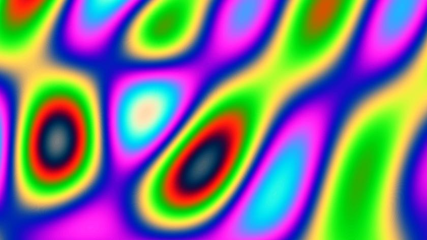

  
\[Click on image to jump to the interactive demonstration\]

# Emotions

## Welcome to the Wonderful World of shader rendering

Interactive demoscene lava artwork for and dedicated to Peter.

You can change the formula, just edit them in the appropriate boxes.

## Versioning

Using [SemVer](http://semver.org/) for versioning. For the versions available, see the [tags on this repository](https://github.com/xyzzy/emotions/tags).

## License

This project is licensed under the MIT License - see the [LICENSE](LICENSE) file for details
